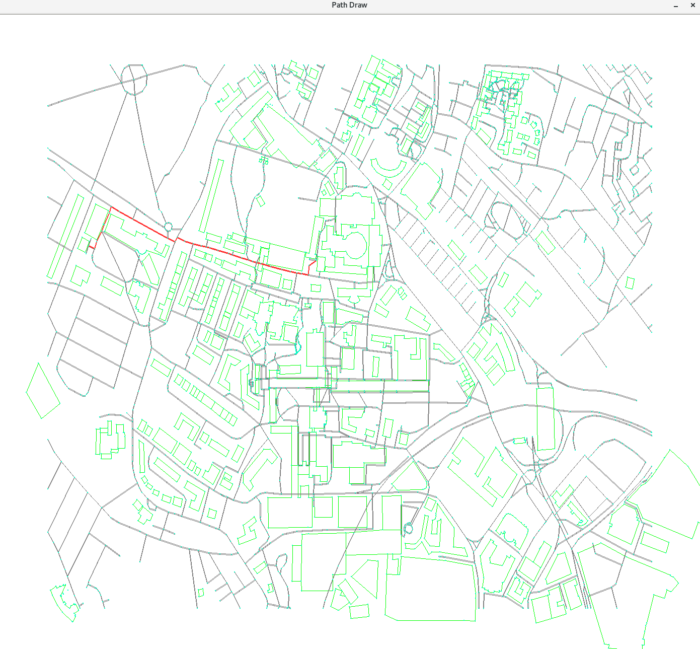

# XJCO 1921 Coursework 2

Welcome to the Map Navigator!

This project is a C program designed for map pathfinding. It reads in map data, generates an adjacency matrix representation of the map, allows the user to modify the map, finds the shortest path between two points(can pass a location or POI) using Dijkstra's algorithm, and visualizes the path on the map.

Getting Started

To use this program, you need to have a C compiler installed on your computer. To compile the source code provided, simply run the following command in your terminal:

    make

After compiAfter compiling the source code, you can run the program by executing the main executable file.

    ./main

Finally, you can follow the message printed and get the path visualized on the map.

Test

To ensure the correctness of our program, I have created a test file named "test.sh". This test file includes a large amount of data processing that is used to check whether the program output results are as expected for different input conditions. During the execution of the test file, the program's output results will be automatically compared with the expected results, and if any differences are found, the test will fail.

You can execute the test file by running the following command in the terminal:

    make
    bash test.sh

Note: In order to avoid visualization affecting the test speed, you have to change the code in pathVisualizer.c

    // delay for 1 millisecond to run test.sh
    SDL_RenderPresent(renderer);
    SDL_Delay(1);

Contributors

-Yifan Xiang
